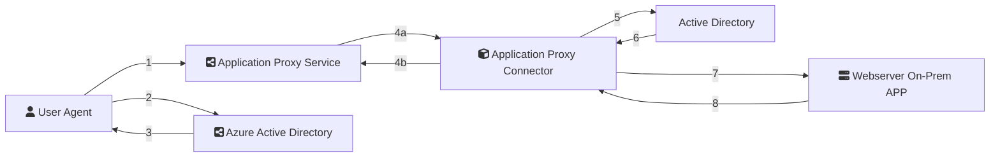

# Introduction
Azure Application Proxy è un servizio di Microsoft Azure che consente l'accesso remoto alle applicazioni da qualsiasi dispositivo dotato di browser web senza bisogno di una VPN. Fornisce un accesso sicuro alle applicazioni on-premises, implementando un Front-End PROXY che risponde alle richieste inviate direttamente al cloud di Azure.

## How does the Application Proxy work?

**1.** Lo *User Agent* tenta una connessione all'indirizzo **ENDPOINT** esposto dal *Application Proxy Connector*.

**2.** Se si tratta del primo accesso lo *User Agent* viene redirezionato alla procedura di login *Azure Active Directory*.

**3.** Ottenuto il token di accesso valido, viene eseguito un altro HTTP redirect che porta lo *User Agent* all'indirizzo **ENPOINT** esposto dal *Application Proxy Connector*. Quindi *Azure EntraID* si occupa dell'autenticazione (*authentication stage*) delle crendeziali utente.
 
**4a.** Lo **Application Proxy Service** attraverso il tunnel invia una richiesta **Application Proxy Connector** facendo inoltro delle inforazioni HTTP Request *User Agent* contestualizzandole alla ON-PREM Application a cui si riferiscono.

**4b.** Le istanze di *Proxy App Connector* possono esser una o più di una per ragioni di resilienza del servizio; queste comunicazione sono di tipo *OUTBOUND* e transitando su porta 443 contengono sia il payload del *response* restituito dalla ON-PREM contattata, che la notifica di attività del *Proxy Connector* al *Proxy Service*.

**5.** Le modalità di ON-PREM Authentication possono differire, in particolare, se la ON-PREM APP utilizza la modalità *Windows Integrated Authentication* (aka Kerberos), opzionalmente *Proxy App Connector* richiederà *Kerberos Ticket* per impersonare le credenziali utente corrette quando la richiesta viene inoltrata al *Webserver On-Prem APP*.

**6.** *Active Directory* installato ON-PREM restituirà i Kerberos Ticket sulla base dello User Claim ricevuto.

**7.** Il *Webserver On-Prem APP* riceve le informazioni richiesta aggiunte delle informazioni utente per l'autenticazione.

**8** *Webserver On-Prem APP* restituisce *Proxy App Connector* la risposta sulla base della richiesta ricevuta e contestualizzata alle credenziali utente.

> **Note**: Lo step **2.** può non esser necessario se il tipo di autenticazione per accedere all'indirizzo ENDPOINT ha un settaggio di tipo *PASSTHROUGH*. Tuttavia in uno scenario **Zero Trust Access** la schematica *PRE-AUTH* è quella consigliata.

### Prerequisites

* Azure Entra ID Tenant
* Azure Entra ID Premium 1 or 2
* Application Administrator Role
* Windows Server must do the registry edit.

### Key Benefits

* Secure Remote Access
* Single Sign-On (SSO)
* No VPN Requirement
* No INBOUNT access
* Pre-Authentication and Authorization
* Hybrid Deployment Support
* Cost-effective solution

### Enable Application Proxy

Se non è già abilitato Navigare in *Azure Entra ID Directory* > *Application Proxy* ed effettuare l'attivazione una tantum del *Proxy dell'applicazione*.

#### Install and configure the App Proxy connector on the Proxy Server

Visitare la pagina *Application Proxy* e scaricare il servizio facendo click su *Download connector service*. Il Connector andrà installato su ON-PREM server che abbia modo di raggiungere la ON-PREM APP che si vuole pubblicare. Effettuare l'accesso con le credenziali di amminstratore Microsoft Entra ID durante la procedura d'installazione. I servizi Windows Server installati ON-PREM sono "Connector Service" e "Update Service", ed esendo di poco impatto elaborativo è comunque possibile eseguirne l'installazione anche sulla macchina ON-PREM dove è in esecuzione la ON-PREM APP da pubblicare.

> **Note**: E' buona pratica creare un nuovo *Connector Group* specifico per l'applicazione che si andrà a pubblicare; in genere, se non si hanno esigenze particolari, il nuovo *Proxy App Connector* sarà contenuto del *Connector Group* di default.

### Create you own enterprise application

Visitando la pagina *Enterprise Application* (Applicazioni aziendali) avviare la procedura di setup applicazione facendo click su *Nuova applicazione*. Oltre ad assegnare un nome significativo andrà selezionata la voce del radio button per la configurazione dell'*Application Proxy*.

Le informazioni richieste sono divise in due sottogruppi denominati *Basic* e *Advanced*. 

#### Application Proxy "Basic" Options

 * **Internal Url**: L'indirizzo per raggiungere il *Webserver On-Prem APP*
 * **External Url**: L'indirizzo che verrà esposto pubblicamente per raggiungere il nuovo *ENDPOINT*
 * **Pre Authentication**: *Azure Active Directory* è l'impostazione fondamentale per il *pre-authentication*
 * **Connector Group**: Il gruppo di *Connector* precedentemente creato

#### Application Proxy "Advanced" Options

 * **Translate Urls in headers**: Vengono automaticamente tradotti gli indirizzi URL per rendere trasparente l'utilizzo della *On-Prem APP* anche dall'esterno.
 * **Translate Urls in application body**: Vengono automaticamente tradotti gli indirizzi URL (contenute nel HTTP request body) per rendere trasparente l'utilizzo della *On-Prem APP* anche dall'esterno.
 * **Validatie Backend SSL Certificate**: Vengono gestiti i certificati SSL caricati
 
> **Note**: Attivare *PRE-AUTH* comporta che la *Webserver On-Prem APP* diventi una *Azure Enterprise Application* gestita da "Azure Active Directory" aggiungendo diverse modalità definite come *request conditional access rule* tra cui, ad esempio, la necessità di richiede l'autenticazione a più fattori e più in generale si gestiscono gli *user risks* e *signing risks*. Trattandosi di un'applicazione web, utilizzeremo http come serviceclass per la configurazione SPN che segurà due passi da eseguirsi da CLI amministratore: `setspn -Q http/webapp.domain.local` per effettuare la query sull'esistenza del nuovo SPN e `setspn -A http/webapp.domain.local computername` per registrare un SPN mancante.
 
#### Header-based Single Sign-on and User imperasonation

Esistono varie opzioni per il *SSO*, ma in generale nelle soluzioni *CLOUD based* si fa affidamento su autenticazione *SAML based* e se questa schematica viene supportata dalla *Webserver On-Prem APP* è possibile passarla come token. Tuttavia, nel caso di *Legacy App*, si preferisce la schematica *Kerberos* con funzionalità *Windows authentication integrated*. Per queste ragioni si deve soddisfare i pre-requisiti secondo cui l'istanza Windows Server ON-PREM deve esser *domain joined* (ie, part of the same domain or trusting domains) e deve aver accesso all'attributo AD denominato *TokenGroupsGlobalAndUniversal* in quanto il *Proxy App Connector* deve esser in grado di completare l'operazione di *Windows User Impersonation*.

In termini generali è possibile aggiungere nel Request Header campi Active Directory come *UserDisplayName* (user.displayname) e *UserUPN* (user.userprincipalname), ma in caso la situazione lo richieda è possibile passare anche credenziali di accesso per inoltrarle al *Webserver On-Prem APP*, implementando anche meccanismi di *Password Vaulting*.

In Azure per attivare il *Windows Integrated Authentication*, durante la procedura di registrazione applicazione, è da assegnare ub *service principal* (aka, SPN) creato nella Enterprise e per assegnare l'accesso all'applicazione è necessario avere il ruolo di *Global Administrator*, *Cloud Application Administrator*, *Application Administrator* o proprietario del service principal. In genere come Delegate Login Identity si seleziona *On-premises SAM account name*.

Select Single sign-on and Windows Integrated Authentication
